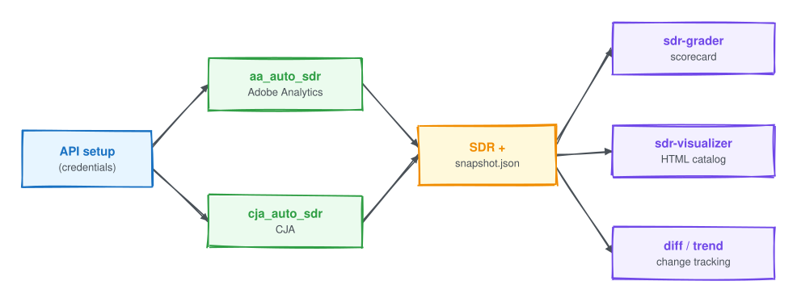

# Claude Code Skills

A collection of Claude Code skills for Adobe Analytics and Customer Journey Analytics. Use them to understand the core concepts, set up API access, and run the Solution Design Reference tools for generating, grading, visualizing, and tracking your implementation.

## Skills

### Concepts

| Skill                                                                                      | What it does                                                                                                                                            |
| ------------------------------------------------------------------------------------------ | ------------------------------------------------------------------------------------------------------------------------------------------------------- |
| [adobe-analytics-concepts](skills/adobe-analytics-concepts/SKILL.md)                       | Explains Adobe Analytics concepts such as eVars, props, events, scopes, attribution, tracking design, and governance. It does not connect to live data. |
| [customer-journey-analytics-concepts](skills/customer-journey-analytics-concepts/SKILL.md) | Explains CJA concepts such as connections, data views, datasets, identity and stitching, and cross channel analysis. It does not connect to live data.  |

### Setup

| Skill                                                                  | What it does                                                                                                                                              |
| ---------------------------------------------------------------------- | --------------------------------------------------------------------------------------------------------------------------------------------------------- |
| [adobe-analytics-api-setup](skills/adobe-analytics-api-setup/SKILL.md) | Sets up Adobe Analytics API 2.0 access with OAuth Server to Server auth, for `aa_auto_sdr`. Use it to configure credentials or to fix 401 and 403 errors. |
| [adobe-cja-api-setup](skills/adobe-cja-api-setup/SKILL.md)             | Sets up Adobe CJA and AEP API access with OAuth Server to Server auth, for `cja_auto_sdr`. Use it to configure credentials or to fix 401 and 403 errors.  |

### SDR tooling

| Skill                                                                              | What it does                                                                                                                                                    |
| ---------------------------------------------------------------------------------- | --------------------------------------------------------------------------------------------------------------------------------------------------------------- |
| [aa-auto-sdr](skills/aa-auto-sdr/SKILL.md)                                         | Runs the `aa_auto_sdr` CLI to generate Solution Design Reference docs from Adobe Analytics report suites, with batch runs, snapshots, diffs, and quality gates. |
| [cja-auto-sdr](skills/cja-auto-sdr/SKILL.md)                                       | Runs the `cja_auto_sdr` CLI to generate SDR docs from CJA Data Views, diff and snapshot changes, run org wide reports, and publish to Notion.                   |
| [sdr-visualizer](skills/sdr-visualizer/SKILL.md)                                   | Runs `sdr-visualizer` to turn SDR snapshots into an HTML catalog you can browse and search, with a reference graph and Changes and Trend views.                 |
| [sdr-grader](https://github.com/brian-a-au/sdr-grader/tree/main/skills/sdr-grader) | Reads and explains an `sdr-grader` grade report. This skill lives in the [sdr-grader repo](https://github.com/brian-a-au/sdr-grader), so install it from there. |

### Workflow

| Skill                                        | What it does                                                                                                                                                               |
| -------------------------------------------- | -------------------------------------------------------------------------------------------------------------------------------------------------------------------------- |
| [sdr-workflow](skills/sdr-workflow/SKILL.md) | Ties the SDR tools together. It walks you through generating, grading, visualizing, and diffing an implementation for audits, migrations, drift monitoring, and CI gating. |

## The SDR ecosystem

These skills wrap a set of command line tools. Each tool installs from PyPI with `uv tool install`.

| Tool                                                           | Role                                                      |
| -------------------------------------------------------------- | --------------------------------------------------------- |
| [aa_auto_sdr](https://github.com/brian-a-au/aa_auto_sdr)       | Generate SDR docs and snapshots from Adobe Analytics      |
| [cja_auto_sdr](https://github.com/brian-a-au/cja_auto_sdr)     | Generate SDR docs and snapshots from CJA                  |
| [sdr-grader](https://github.com/brian-a-au/sdr-grader)         | Grade a snapshot against a rubric and produce a scorecard |
| [sdr-visualizer](https://github.com/brian-a-au/sdr-visualizer) | Build an HTML catalog you can browse from a snapshot      |

The `sdr-grader` skill listed above lives in its own repository, so install it from there. The `sdr-workflow` skill in this collection covers how to run the grader as part of the full workflow.

### How it fits together



You set up credentials once, generate an SDR and a snapshot from Adobe Analytics or CJA, then grade, visualize, or diff that snapshot. The `sdr-workflow` skill runs this whole flow end to end.

The diagram is editable: open [`assets/how-it-fits-together.excalidraw`](assets/how-it-fits-together.excalidraw) at [excalidraw.com](https://excalidraw.com) to change it.

## Installation

You need [Claude Code](https://docs.anthropic.com/en/docs/claude-code) installed and configured. There are two ways to install the skills.

### Option A: Install as a plugin (recommended)

Add this repo as a plugin marketplace, then install the plugin. You get versioned installs and one-command updates.

```
/plugin marketplace add brian-a-au/bau-claude-skills
/plugin install bau-claude-skills@bau-claude-skills
```

The skills are then available in every session, namespaced as `/bau-claude-skills:<skill-name>`, for example `/bau-claude-skills:aa-auto-sdr`. Update later with:

```
/plugin marketplace update
```

### Option B: Copy the skill folders

Clone the repo and copy the skills you want into your Claude skills directory.

```bash
mkdir -p ~/.claude/skills
git clone https://github.com/brian-a-au/bau-claude-skills.git
cd bau-claude-skills

# one skill
cp -r skills/adobe-analytics-api-setup ~/.claude/skills/

# or all of them
cp -r skills/* ~/.claude/skills/
```

Check the install with `ls ~/.claude/skills/`, then start a new session. If you installed an earlier version, remove the folders that were renamed. `cja-sdr-generator` is now `cja-auto-sdr`, and `adobe-api-setup` was split into `adobe-analytics-api-setup` and `adobe-cja-api-setup`.

```bash
rm -rf ~/.claude/skills/cja-sdr-generator ~/.claude/skills/adobe-api-setup
```

Update later by pulling and copying again:

```bash
cd bau-claude-skills
git pull
cp -r skills/* ~/.claude/skills/
```

## Requirements

The skills themselves only need Claude Code. The SDR command line tools they drive (`aa_auto_sdr`, `cja_auto_sdr`, `sdr-grader`, `sdr-visualizer`) need Python 3.14 or newer and install from PyPI, best with [uv](https://docs.astral.sh/uv/):

```bash
uv tool install aa-auto-sdr
```
